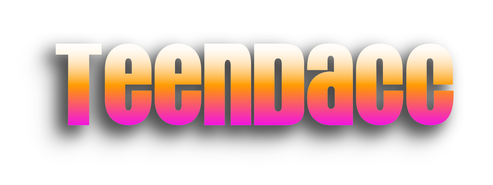

# 🐒 Introduction

<figure><figcaption></figcaption></figure>

<figure><figcaption>
What a handsome little monkey!
</figcaption></figure>

TeenDACC is an investment NFT on the Cronos blockchain.

TeenDACC aims to become a premier investment for staked NFT holders.

Collection details:

* 77 traits&#x20;
* 7 unique NFTs
* 7777 total supply at launch

This collection also includes

* investment rewards
* buy-back-and-burn

## Why TeenDACC?

This NFT collection attempts to solve the following two problems:

1. NFTs often have no clear value.&#x20;
2. It is both confusing and time-consuming to deal with multiple different investment products from multiple different projects all at the same time.&#x20;

The way that TeenDACC attempts to solve these problems is by creating an NFT with a built-in investment portfolio called the [Investment Vault](the-investment-vault.md). The Investment Vault will pay out the interest that it generates to NFT holders through the investment rewards site [https://dacc.netlify.app](https://dacc.netlify.app) \
All of this wrapped up into a single easy-to-manage "handsome little monkey" NFT collectible.

The TeenDACC project also aims to build a community of investors and utilize the combined knowledge and wisdom of this community to seek out the greatest available investment opportunities. \
\
Eventually, we plan to launch our first major development project which will be a series of games that will utilize our NFT projects, as well as our own Cryptocurrency Token on the Cronos chain. We have tentatively named this project "LSU". It will be easy, secure, and inexpensive, and a portion of the proceeds will go to the [investment vault](the-investment-vault.md). LSU will become the next major chapter of the DACC project, and we can't wait to share it with the rest of the community.

The final stage of the TeenDACC project will be to automate the entire process so that it no longer requires any human intervention to manage its funds or to make payouts to NFT holders.&#x20;
